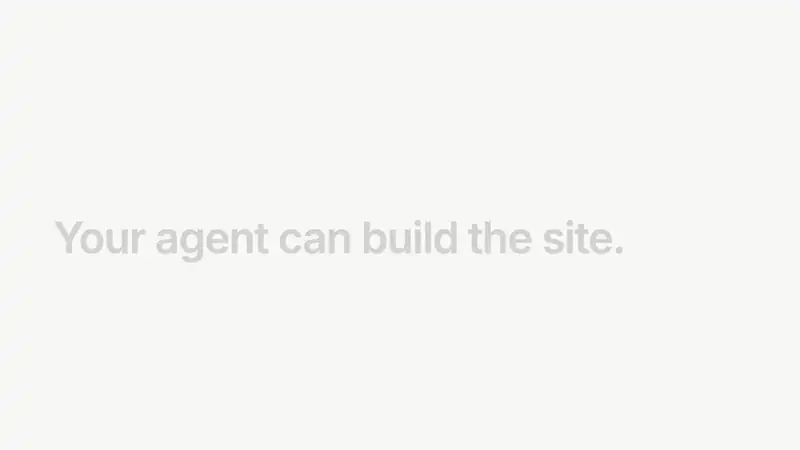

# Novence MCP

Hosted [Model Context Protocol](https://modelcontextprotocol.io) server for **Novence** — static site hosting for AI agents.

Your agent can build the site. Then in seconds, give it somewhere to ship.

<p align="center">
  <a href="assets/novence-install-20s.mp4">
    
  </a>
  <br />
  <sub>20 seconds · Claude Code, Cursor, Codex, or any other agent · plugin to a live URL</sub>
</p>

- **Endpoint:** `https://api.novence.ai/mcp` (streamable HTTP)
- **Auth:** optional to start. Call `bootstrap(email)`; the session adopts the `nv_` key. Then `Authorization: Bearer nv_…` for later sessions.
- **Docs:** [novence.ai/mcp](https://novence.ai/mcp)
- **Privacy:** [novence.ai/privacy](https://novence.ai/privacy)

This repository is the **Claude Code plugin / install package** ([Novence-ai/mcp](https://github.com/Novence-ai/mcp)). The MCP server itself is hosted; there is nothing to run locally.

The `Dockerfile` and `catalog/` stdio adapter are **only** for MCP directories (Glama). They answer `tools/list` with public tool schemas. They do not contain the hosting API. End users should use `https://api.novence.ai/mcp`.

Root `.mcp.json` (and `mcp.json` for Cursor / Agent Plugins) is **Cursor-safe**: URL only, no Claude `${user_config.*}` placeholders. After bootstrap, Cursor / shell clients persist auth with env `NOVENCE_API_KEY` and a Bearer header. The Claude Code plugin keeps Keychain / `userConfig.api_key` via `.claude-plugin/plugin.json` inline `mcpServers`.

Skill for registries: `skills/novence-deploy` (`gh skill install Novence-ai/mcp novence-deploy` when available).

## Install (Claude Code)

```bash
claude plugin marketplace add Novence-ai/mcp
# or: enable from the Claude plugin directory after listing is approved
```

Leave **Novence API key** blank. Call `bootstrap(email)` (MCP). After the live URL, paste the `nv_` key in plugin settings (Keychain) and run `/reload-plugins` so later sessions stay authenticated.

Claude stores the key via **plugin `userConfig`**. Empty interpolation is treated as unauthenticated (`Bearer ` / uninterpolated `${user_config.api_key}`), so bootstrap works before you fill the field.

## Cursor / shell

Root `.mcp.json` matches this URL-only shape (no auth header). Connect with no header, then bootstrap:

```json
{
  "mcpServers": {
    "novence": {
      "url": "https://api.novence.ai/mcp"
    }
  }
}
```

After `bootstrap`, persist the key:

```bash
export NOVENCE_API_KEY='nv_…'
```

```json
{
  "mcpServers": {
    "novence": {
      "url": "https://api.novence.ai/mcp",
      "headers": {
        "Authorization": "Bearer ${env:NOVENCE_API_KEY}"
      }
    }
  }
}
```

One-click install (no key): [Add to Cursor](https://novence.ai/mcp#connect)

## Generic MCP clients

Same as Cursor: URL only first, then add `Authorization: Bearer nv_…` after bootstrap.

REST fallback if you are not on MCP:

```bash
# Deploy first (no email): curl -sS -X POST https://api.novence.ai/v1/demo
curl -sS -X POST https://api.novence.ai/v1/bootstrap \
  -H 'Content-Type: application/json' \
  -d '{"email":"you@example.com"}'
```

Verify the emailed OTP after the live URL to unlock full Free quotas.

## Tools

| Tool | Description |
| --- | --- |
| `bootstrap` / `verify_email` / `resend_verification` / `reissue_key` | Signup without a prior `nv_` key; OTP after live URL |
| `create_project` / `list_projects` / `get_project` / `update_project_settings` | Project lifecycle (optional `share_gate_emails` OTP on `*.novence.ai` only) |
| `get_upload_url` / `get_upload_urls_batch` / `confirm_upload` / `confirm_uploads_batch` | Upload site files |
| `list_files` / `get_file` / `delete_file` | Manage project files |
| `set_redirects` | Stage `/_redirects` (SPA: `/* /index.html 200`); call `deploy` to apply |
| `put_site_data` | Live `/data/{name}.json` without a deploy (Pro/Scale) |
| `deploy` / `get_deployment_status` / `get_preview_url` / `rollback` | Publish, poll, preview aliases (Pro/Scale), rollback last 5 |
| `publish_html` | One HTML document → `index.html` + deploy (omit project_id to create) |
| `run_checks` / `get_checks_results` | Quality checks (Lighthouse, a11y, links) |
| `configure_custom_domain` / `get_domain_status` | Custom domains (CNAME www → fallback.novence.ai; apex ALIAS **or** URL-redirect) |
| `create_form` / `list_forms` / `update_form` / `list_form_submissions` / `delete_form_submission` | Forms |
| `checkout` / `mpp_upgrade` / `billing_portal` | Paid plans (verified email; after 2nd project or a 402) |
| `get_quotas_and_usage` / `get_project_usage` / `update_project_settings` (`analytics_enabled`) / `get_project_analytics` / `get_account` | Quotas, usage, and opt-in site traffic |
| `create_account_session` / `get_account_console_kit` | Billing/account console kit (never embed `nv_` in HTML) |

## Official registry

Published as `ai.novence/mcp` on [registry.modelcontextprotocol.io](https://registry.modelcontextprotocol.io).

## License

MIT — see [LICENSE](./LICENSE).
